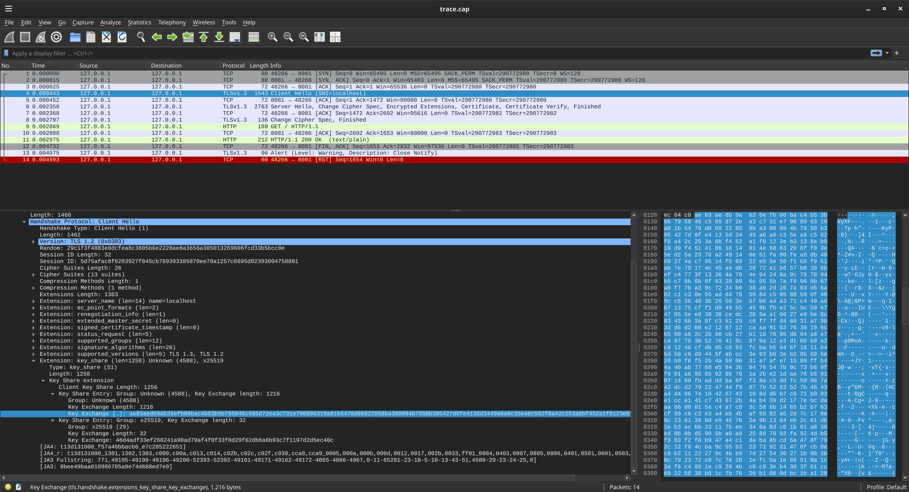
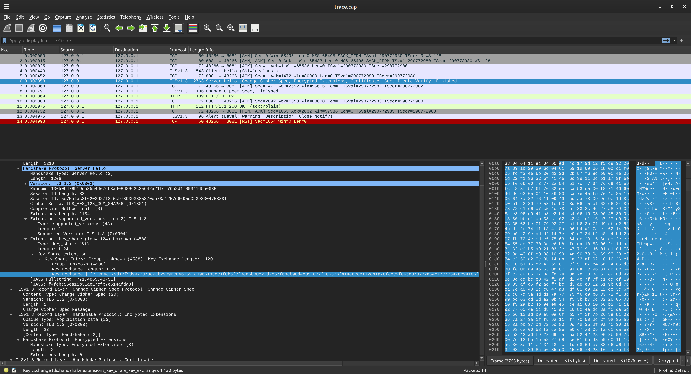

### X25519MLKEM768 client server in go

Simple client/server demo in golang which uses the `X25519MLKEM768` key exchange.

Basically, its a http client/server using where the arrive arrive at the same shared key on both ends which involving both `ML-KEM` and `X25519`.

* [Post-quantum hybrid ECDHE-MLKEM Key Agreement for TLSv1.3](https://www.ietf.org/archive/id/draft-kwiatkowski-tls-ecdhe-mlkem-02.html)

```text
const X25519MLKEM768 CurveID = 4588

5.2.  X25519MLKEM768

   Value:  4588 (0x11EC)
   Description:  X25519MLKEM768
   DTLS-OK:  Y
   Recommended:  N
   Reference:  This document
   Comment:  Combining X25519 ECDH with ML-KEM-768
```

This repo also demonstrates the "raw" key exchange thats described in the RFC and in the posts below

---

References:

* [TLS 1.3 Hybrid Key Exchange using X25519Kyber768 / ML-KEM](https://www.netmeister.org/blog/tls-hybrid-kex.html)
* [Real-world post-quantum TLS in Wireshark](https://sharkfest.wireshark.org/retrospective/sfus/presentations24/02.pdf)
* [Kyber - How does it work?](https://cryptopedia.dev/posts/kyber/)

---

### golang


For golang, this is new in `go1.24rc1+` so you need to install that version atleast (`go install golang.org/dl/go1.24rc1@latest`)

```bash
# export SSLKEYLOGFILE=tls.keylog
# sudo tcpdump -s0 -iany -w trace.cap "port 8081 and (host localhost)"
export GODEBUG=tlsmlkem=1
go run server/main.go

# in a new window
export GODEBUG=tlsmlkem=1
go run client/main.go
```

### Step by Step X25519MLKEM768 

To see the full key generation and exchange offline done by TLS, the following will run through the protocol and key generation.

That is, it'll generate the client EC and KEM keys, exchange it with the server's one and arrive at the shared secret...just like the real protocol

```bash
$ go run tls_X25519MLKEM768/main.go 

SharedSecret: kemShared (223ade9552768013aa9317b99c7a3472f552f9367481bd89d929991b146ae3f8) || ecShared (2356f713c6eaef695d1de30527ff0c7e127181fe00490cf6ff786a557d8fa543)
SharedSecret: kemShared (223ade9552768013aa9317b99c7a3472f552f9367481bd89d929991b146ae3f8) || ecShared (2356f713c6eaef695d1de30527ff0c7e127181fe00490cf6ff786a557d8fa543)

```


### Trace

```bash
wireshark trace.cap -otls.keylog_file:tls.keylog -otcp.reassemble_out_of_order:TRUE
```

- `ClientHello`



- `ServerHello`



---

### BoringSSL

If you wanted to run a client/sever using [boringssl](https://boringssl.googlesource.com/boringssl/+/HEAD/BUILDING.md), use `X25519Kyber768Draft00`

```bash
bssl s_server \
        -accept 8081 \
        -key certs/localhost.key -cert certs/localhost.crt -curves X25519Kyber768Draft00   -www 

bssl client -root-certs certs/root-ca.crt -connect localhost:8081 -server-name localhost -curves X25519Kyber768Draft00
```